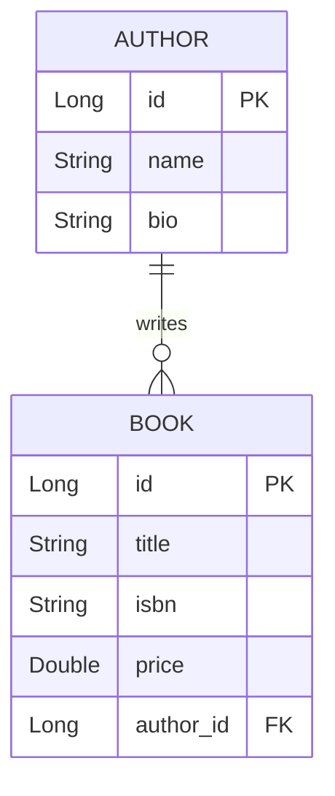
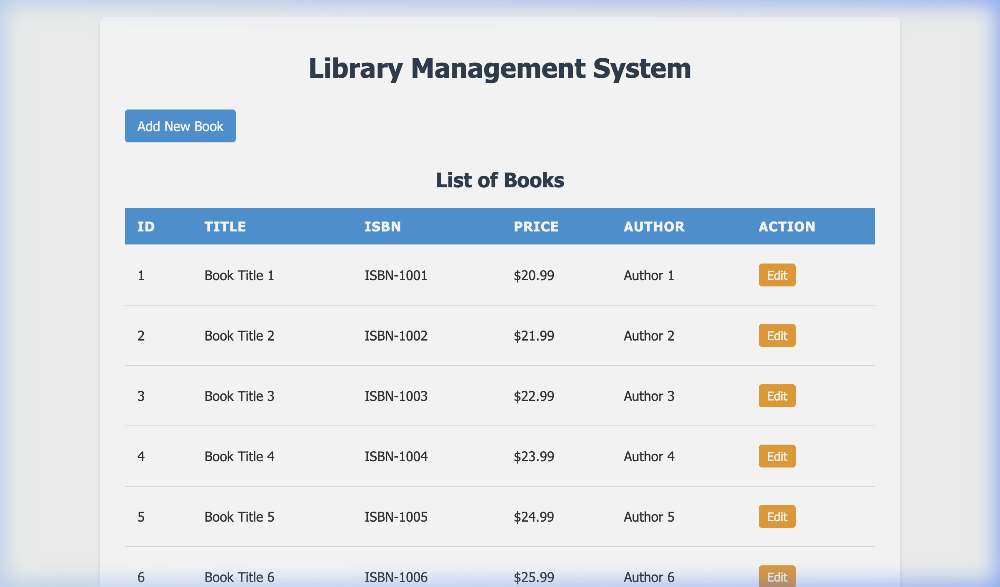
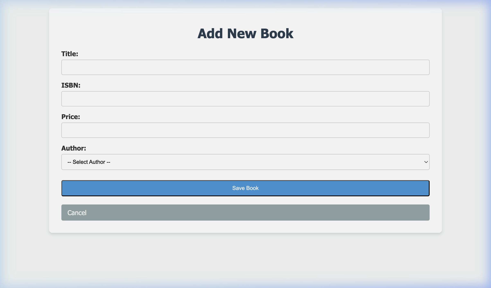
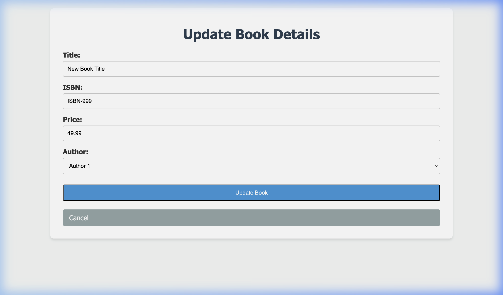

# Project Documentation: Spring Boot Library Application

This document provides a detailed overview of the Spring Boot application developed to manage Authors and Books.

## Github URL
**Repository:** [https://github.com/ramneek3/bits-sga2.git](https://github.com/ramneek3/bits-sga2.git)

---

## 1. Entity Relationship Design

The application manages two primary entities: **Author** and **Book**, with a **One-to-Many** relationship.



- **Author Entity:** Represents the creator of books. One author can have multiple books.
- **Book Entity:** Represents a specific publication. Each book is associated with exactly one author.

---

## 2. Implementation Details

### Technology Stack
- **Framework:** Spring Boot 3.5.14
- **Language:** Java 17
- **Database:** H2 In-memory Database
- **Persistence:** Spring Data JPA (Hibernate)
- **View Engine:** JSP (JavaServer Pages) with JSTL
- **Styling:** Vanilla CSS

### Core Operations

#### Read Operation (List All Entities)
The application displays a list of all books along with their respective authors. This is achieved using a custom inner join query in the repository layer to fetch all related data in a single request.

**Repository Code:**
```java
@Query("SELECT b FROM Book b JOIN FETCH b.author")
List<Book> findAllBooksWithAuthors();
```

**Read Operation Screenshot:**


---

#### Create Operation (Add New Entity)
Users can add new books via a web form. The form includes validation and error handling for integrity violations.

**Controller Code:**
```java
@PostMapping("/add")
public String addBook(@ModelAttribute("book") Book book, Model model) {
    try {
        libraryService.saveBook(book);
        return "redirect:/";
    } catch (Exception e) {
        model.addAttribute("error", "Error saving book: " + e.getMessage());
        return "add";
    }
}
```

**Create Operation Screenshot:**


**Updated List after Create:**


---

#### Update Operation (Edit Existing Entity)
The update functionality allows users to modify the details of existing books.

**Controller Code:**
```java
@PostMapping("/update/{id}")
public String updateBook(@PathVariable("id") Long id, @ModelAttribute("book") Book bookDetails, Model model) {
    Book existingBook = libraryService.getBookById(id);
    existingBook.setTitle(bookDetails.getTitle());
    existingBook.setIsbn(bookDetails.getIsbn());
    existingBook.setPrice(bookDetails.getPrice());
    libraryService.saveBook(existingBook);
    return "redirect:/";
}
```

**Update Operation Screenshot:**


**Final List after Update:**


---

## 3. Challenges Faced & Solutions

| Challenge | Solution |
| :--- | :--- |
| **JSP Configuration in Spring Boot 3+** | JSP is not the default template engine. I had to manually add `tomcat-embed-jasper` and Jakarta-specific JSTL dependencies to `pom.xml` and configure the View Resolver in `application.properties`. |
| **Legacy Code Conflicts** | The workspace contained leftover files from previous sessions that caused compilation errors. I performed a cleanup of the `src` directory to ensure only relevant code was present. |
| **N+1 Query Issue** | Standard fetching would lead to multiple queries for authors. I implemented a `JOIN FETCH` JPQL query in the repository to optimize performance. |
| **Data Initialization** | Ensuring exactly 10 rows per table on startup. I used a `@PostConstruct` method in the service layer to check existing counts and populate sample data only if the database is empty. |

---

## 4. Testing Summary

Unit tests were implemented for both the service and repository layers using **JUnit 5** and **Mockito**.
- **Service Tests:** Verified that business logic (saving and fetching) works with mocked repositories.
- **Repository Tests:** Verified that the custom JPA join query correctly fetches the associated Author entities.

All tests passed successfully before deployment.
